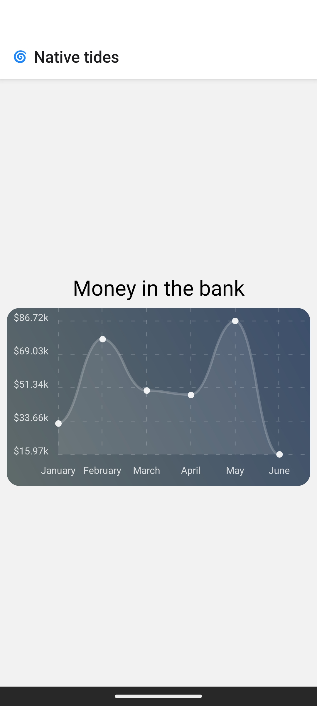

# 🌀 Native tides



Welcome to the learning module for [CodeSail](https://codesail.co.nz) on React Native.

## Installing

- Editor: https://code.visualstudio.com/
- React Native: https://reactnative.dev/docs/set-up-your-environment

## Lessons

1. Install dependencies

```sh
npm install
```

2. Start react native expo (on your device)

```
npx expo run:android
```

To see any of the lessons open up `app/index.tsx` and insert any of the page components.

E.g.

```tsx
<View style={styles.center}>
  <Buttons />
</View>
```

## Credits

Aura by Alex-Productions | https://onsound.eu/

Music promoted by https://www.chosic.com/free-music/all/

Creative Commons CC BY 3.0
https://creativecommons.org/licenses/by/3.0/
